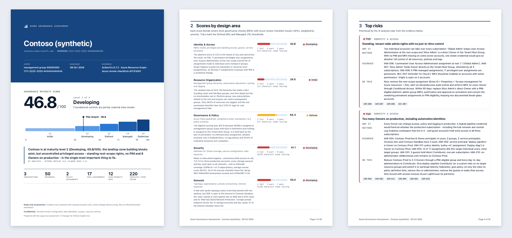

# AzGovViz Assessment – GitHub Copilot CLI plugin

Run **AzGovViz** (Azure Governance Visualizer) on a selected Microsoft Entra tenant, evaluate the
**Azure/review-checklists** (Azure Landing Zone, Well-Architected, APRL and more) with Azure Resource Graph,
let Copilot analyse the evidence, and get a **scored PDF assessment report** (plus the same report as an
interactive, self-contained HTML file).

```text
copilot> /azgov-assess <tenant-id>
  doctor     PowerShell 7, Az.Accounts, AzAPICall, Reader on the tenant root management group
  AzGovViz   management groups, Azure Policy, RBAC, Defender for Cloud, network, cost (read-only)
  ARG        Resource Graph inventory + ALZ / WAF / APRL checklist queries
  analysis   ~60 scored platform findings, nine design areas, maturity level
  Copilot    executive summary, top risks, 30/90/180-day roadmap (analysis/ai-insights.json)
  report     azgov-assessments/<tenant>_<timestamp>/report/Azure-Governance-Assessment_<tenant>_<date>.pdf (+ .html)
```



## What you get

| | |
|---|---|
| **Executive summary** | Maturity score (0–100) on a five-level scale, AI-written narrative, severity tiles. |
| **Nine design areas** | Identity & access, resource organization, governance & policy, security, network, management & monitoring, reliability, cost, performance – each scored from tenant checks (60%) and checklist results (40%). |
| **Top risks + roadmap** | Prioritised by business risk, sequenced Now / Next / Later, every item linked to evidence. |
| **~60 platform findings** | From AzGovViz + Resource Graph: privileged access (owners, guests, service principals, PIM, orphaned and classic admins, wildcard custom roles), management-group structure, policy coverage and enforcement, Defender for Cloud plans and contacts, logging/alerting, network exposure, budgets, orphaned resources, tagging and naming… each with evidence rows and a fix. |
| **Azure review checklists** | Every ALZ/WAF/APRL item with a Resource Graph query evaluated per resource (compliant / partial / non-compliant / not applicable), manual ALZ items answered with tenant evidence where possible, full searchable item list, export for the official Excel workbook. |
| **Environment** | Management-group tree, subscriptions table (secure score, Defender plans, budgets, activity-log export), resources by type and region, Advisor and Defender recommendations. |

The **PDF** (A4) has a cover page with the score and maturity scale, numbered sections and page numbers; it is printed
with headless Microsoft Edge / Google Chrome / Chromium. The **HTML** version is a single file (no external scripts or
fonts) with light/dark themes and filters. Without a Chromium-based browser only the HTML is produced (it prints to PDF
from any browser).

## Install

Requirements: **GitHub Copilot CLI**, **Python 3.9+**, **PowerShell 7** (for AzGovViz), git (optional).
Az.Accounts and AzAPICall are installed automatically into the current user scope when missing.

The repository is a one-plugin marketplace (`.github/plugin/marketplace.json`):

```bash
copilot plugin marketplace add kloba/azgovviz-assessment-plugin
copilot plugin install azgovviz-assessment@azgovviz-assessment-marketplace
copilot plugin list                                     # -> azgovviz-assessment
```

From a local clone use the absolute path instead: `copilot plugin marketplace add /path/to/azgovviz-assessment-plugin`.

Inside Copilot CLI you now have:

| Kind | Name | Use it for |
|---|---|---|
| Skill | `azure-governance-assessment` | Full assessment (AzGovViz + checklists + AI analysis + report) |
| Skill | `azure-review-checklists` | Checklists only, Resource Graph only (no PowerShell) |
| Skill | `azgovviz-deep-dive` | Questions about an existing run ("who is Owner where?") |
| Agent | `azure-governance-assessor` | Consultant persona that drives the skills end to end |
| Commands | `/azgov-assess`, `/azgov-checklists`, `/azgov-report`, `/azgov-doctor` | Shortcuts |

## Use

Ask in natural language, or use the commands:

```text
> Assess the Azure governance of tenant <tenant-id> and give me the PDF report
> /azgov-checklists <tenant-id> --checklists alz,waf,aprl,aks
> Who has Owner on the production subscription in the last assessment?
```

Copilot will list tenants if you do not specify one, check prerequisites, ask you to sign in when needed
(`! …/azgov-assess login --tenant <id>` – MFA happens in your browser), run the assessment, write the AI
analysis and render the report.

### Permissions

- **Reader** on the tenant root management group (or the management group / subscriptions you assess).
- Member users need no Entra ID roles; guests or service principals need Graph read permissions
  (see the AzGovViz documentation). PIM data needs Entra ID P2 – otherwise use `--no-pim`.
- Everything is **read-only**. The plugin never changes Azure resources.

## The engine (`azgov-assess`)

The skills drive one stdlib-only Python CLI that you can also run directly:

```bash
S=azgovviz-assessment-plugin/skills/azure-governance-assessment/scripts
$S/azgov-assess doctor --tenant <id>
$S/azgov-assess run --tenant <id> [--subscriptions a,b] [--checklists alz,waf,aprl] [--consumption] [--open]
$S/azgov-assess run --tenant <id> --skip-azgovviz            # Resource Graph + checklists only
$S/azgov-assess insights-template --run-dir <run>           # contract for the AI analysis step
$S/azgov-assess validate-insights --run-dir <run>
$S/azgov-assess report --run-dir <run> [--open] [--no-pdf]    # PDF + HTML (PDF via headless Edge/Chrome)
$S/azgov-assess report --run-dir <run> --baseline <older-run> # adds score deltas and changed findings
```

Pipeline and outputs:

```
AzGovViz (pwsh, read-only) ─┐
Resource Graph inventory  ──┼─> analysis/findings.json ──> Copilot writes analysis/ai-insights.json ──> report/*.pdf + .html
review-checklists (ARG)   ──┘        (scores, findings)        (exec summary, risks, roadmap)
```

```
azgov-assessments/<tenant>_<timestamp>/
  run.json  azgovviz/  inventory.json  checklists/results.json  checklists/graph_results_<key>.json
  analysis/findings.json  analysis/checklists.assessed.json  analysis/brief.md  analysis/ai-insights.json
  report/Azure-Governance-Assessment_<tenant>_<date>.pdf  (+ .html)
```

### How checklist results are interpreted

The checklist repository uses three query conventions; the engine handles all of them:

| Convention | Meaning | Result |
|---|---|---|
| `compliant` column (1/0, true/false) | verdict per row | compliant / partial / non-compliant per item, per resource |
| APRL (`recommendationId`, `param1`…) | rows are the **non-compliant** resources | combined with the resource inventory: absent type → not applicable, no rows → compliant |
| plain listing | evidence only | "evidence for review" |

Items without a query stay "manual"; ALZ manual items that a platform finding can answer (e.g. *no subscriptions
under the root management group*, *Defender plans on all subscriptions*, *PIM in use*) are marked
"assessed via finding". `checklists/graph_results_<key>.json` uses the format of the repository's
`checklist_graph.sh`, so you can import it into the review-checklists Excel workbook.

### Scoring

Severity weights high 3 / medium 2 / low 1 (warnings earn half credit). Design-area score = 60% tenant
checks + 40% checklist items (each checklist GUID counted once). Overall = mean of assessed design areas.
Levels: Initial < 40 ≤ Developing < 60 ≤ Defined < 75 ≤ Managed < 90 ≤ Optimized.

## Develop

```bash
cd azgovviz-assessment-plugin
python3 -m unittest discover -s tests -v
copilot --plugin-dir ./azgovviz-assessment-plugin        # load without installing
```

After changing the plugin, refresh the installed copy – Copilot CLI caches installed plugin files:
`copilot plugin update azgovviz-assessment@azgovviz-assessment-marketplace`.

## Credits

- [Azure Governance Visualizer (AzGovViz)](https://github.com/Azure/Azure-Governance-Visualizer) by Julian Hayward and contributors (MIT).
- [Azure Review Checklists](https://github.com/Azure/review-checklists) by the FastTrack for Azure and community contributors (MIT).

This plugin downloads both projects at run time; it does not redistribute them.
